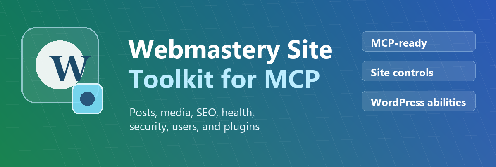
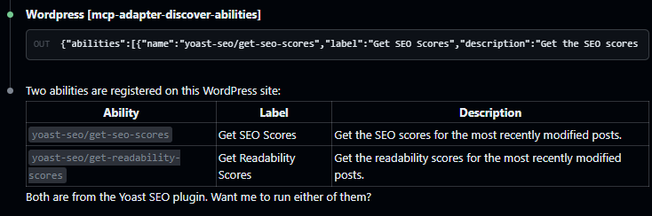
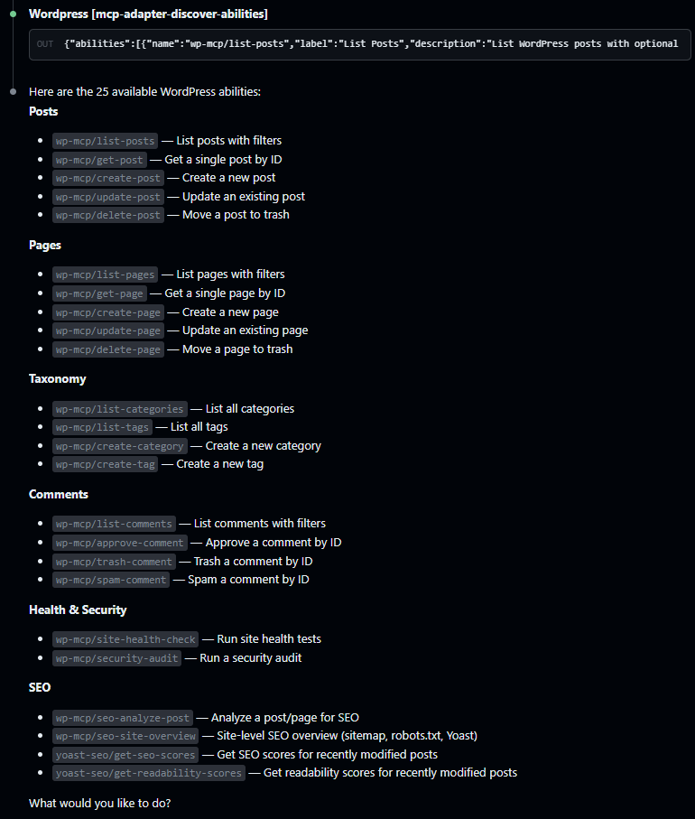

<h2 align="center">
  <br/>
  WP MCP Abilities<br/>
  <sub>Give your AI agent editorial control over WordPress.</sub>
</h2>

<div align="center">
  <h2>
    <a href="https://wordpress.org">
      
    </a>
    <a href="https://www.php.net">
      
    </a>
    <a href="https://www.gnu.org/licenses/gpl-2.0.html">
      
    </a>
  </h2>

[Quickstart](#quickstart) • [Architecture](#architecture) • [MCP Abilities](#mcp-abilities) • [Requirements](#requirements) • [Versioning](#versioning) • [Installation](#installation) • [Verification](#verification) • [Security](#security)

</div>

**WP MCP Abilities** is a companion plugin for the official [MCP Adapter](https://github.com/WordPress/mcp-adapter) by WordPress. The MCP Adapter is a transport framework — it handles the MCP session, REST endpoint, and protocol routing — but ships with no content management abilities out of the box. Any tools an AI agent can actually call must come from plugins that register them. This plugin fills that gap, giving your AI agent the tools to take action: publish a draft, run a security audit, check site health, or analyze a post's SEO.

- You want an AI agent to draft, update, or publish posts and pages
- You want to ask an AI to audit your site's security or health posture
- You want SEO analysis integrated into your content workflow
- You open `mcp-adapter-discover-abilities` and see only the adapter's own meta abilities, with no content tools

### Without this plugin
Only the MCP Adapter's 3 meta/discovery abilities are visible — no content tools.



### With this plugin
All abilities available: full editorial access to posts, pages, taxonomy, comments, media, user lookup, security, and SEO.



---

## Quickstart

**1. Install Official WordPress MCP Adapter Plugin**
Download the [latest release zip](https://github.com/WordPress/mcp-adapter/releases/latest) → WP Admin → Plugins → Add New → Upload Plugin → Install & Activate

**2. Install WP MCP Abilities Plugin**
Download the [latest release zip](https://github.com/DanielBoring/wordpress-mcp-abilities/releases/latest) → WP Admin → Plugins → Add New → Upload Plugin → Install & Activate

**3. Create a dedicated Editor user**
WP Admin → Users → Add New → set Role to **Editor** → Add New User

**4. Create an application password**
WP Admin → Users → edit the user → Application Passwords → enter a name → Add → copy the password

**5. Configure your MCP client**
See [Step 5 — Connect your MCP client](#5-connect-your-mcp-client) for config snippets covering Claude Code, Claude Desktop, GitHub Copilot (VS Code), GitHub Copilot CLI, Codex, Windsurf, Gemini CLI, and ChatGPT.

**6. Verify**
Ask your MCP client or agent to call `mcp-adapter-discover-abilities` — you should see additional abilities enabled by this companion plugin.

---

## Architecture

```
AI Agent (e.g. Claude Code, Codex, etc)
        │
        │  MCP Protocol (JSON-RPC over HTTP)
        ▼
@automattic/mcp-wordpress-remote          ← MCP server (npm process, runs locally)
        │
        │  HTTPS · WordPress REST API
        │  POST /wp-json/mcp/mcp-adapter-default-server
        ▼
MCP Adapter plugin                        ← framework: registers the REST endpoint,
  (WordPress/mcp-adapter)                     handles the MCP session, routes calls
        │
        │  calls wp_register_ability() handlers at runtime
        ▼
WP MCP Abilities plugin               ← this plugin: registers the actual
  (this repo)                                 abilities the AI can call
        │
        │  WordPress core APIs (no direct DB queries)
        ▼
WordPress database
```

The MCP Adapter handles the transport layer. This plugin handles the *content* — it registers abilities using `wp_register_ability()` that the adapter then exposes as MCP tools.

---

## MCP Abilities

New abilities and feature requests are tracked in [GitHub Issues](https://github.com/DanielBoring/wordpress-mcp-abilities/issues).

### Role overview

Each ability enforces a WordPress capability check. The table below maps standard WordPress roles to the plugin-relevant capabilities they provide so you can choose the right role for your MCP service account.

| Role          | Plugin-relevant capabilities provided                                    | Suitable for                                                        |
| ------------- | ------------------------------------------------------------------------ | ------------------------------------------------------------------- |
| Subscriber    | `read`                                                                   | Read-only workflows: taxonomy browsing, health checks, SEO overview |
| Author        | `edit_posts`, `delete_posts`, `upload_files`                             | Creating and managing the agent's own posts and media               |
| **Editor** ✓  | All Author caps + `edit_pages`, `delete_pages`, `manage_categories`, `moderate_comments` | **Full editorial control — recommended default** |
| Administrator | All Editor caps, plus `list_users` for user lookup and other administrative capabilities | User lookup (`list-users` / `get-user`) and future admin-only workflows |

> **Scope note for `edit_posts`:** This capability is available to Authors and above, but WordPress scopes query results to the authenticated user's own content unless `edit_others_posts` is also present. An Editor account (which has `edit_others_posts`) sees all content site-wide. Use Author only if the agent should be limited to content it created.

---

### Posts
| Ability              | Description                                                            | Required Capability | Min. Role |
| -------------------- | ---------------------------------------------------------------------- | ------------------- | --------- |
| `wp-mcp/list-posts`  | List posts with filters (status, search, author, category, pagination) | `edit_posts`        | Author †  |
| `wp-mcp/get-post`    | Get a single post by ID                                                | `edit_posts`        | Author †  |
| `wp-mcp/create-post` | Create a new post with title, content, status, categories, tags        | `edit_posts`        | Author    |
| `wp-mcp/update-post` | Update an existing post                                                | `edit_posts`        | Author †  |
| `wp-mcp/delete-post` | Move a post to trash                                                   | `delete_posts`      | Author †  |

† Returns or acts on the service account's own posts only. Use **Editor** to manage all posts site-wide.

### Pages
| Ability              | Description             | Required Capability | Min. Role |
| -------------------- | ----------------------- | ------------------- | --------- |
| `wp-mcp/list-pages`  | List pages with filters | `edit_pages`        | Editor    |
| `wp-mcp/get-page`    | Get a single page by ID | `edit_pages`        | Editor    |
| `wp-mcp/create-page` | Create a new page       | `edit_pages`        | Editor    |
| `wp-mcp/update-page` | Update an existing page | `edit_pages`        | Editor    |
| `wp-mcp/delete-page` | Move a page to trash    | `delete_pages`      | Editor    |

### Taxonomy
| Ability                  | Description                         | Required Capability | Min. Role  |
| ------------------------ | ----------------------------------- | ------------------- | ---------- |
| `wp-mcp/list-categories` | List all categories                 | `read`              | Subscriber |
| `wp-mcp/list-tags`       | List all tags                       | `read`              | Subscriber |
| `wp-mcp/create-category` | Create a new category               | `manage_categories` | Editor     |
| `wp-mcp/create-tag`      | Create a new tag                    | `manage_categories` | Editor     |
| `wp-mcp/delete-category` | Permanently delete a category by ID | `manage_categories` | Editor     |
| `wp-mcp/delete-tag`      | Permanently delete a tag by ID      | `manage_categories` | Editor     |

### Comments
| Ability                  | Description                                       | Required Capability | Min. Role |
| ------------------------ | ------------------------------------------------- | ------------------- | --------- |
| `wp-mcp/list-comments`   | List comments with filters (post, status, search) | `edit_posts`        | Author    |
| `wp-mcp/approve-comment` | Approve a comment                                 | `moderate_comments` | Editor    |
| `wp-mcp/trash-comment`   | Move a comment to trash                           | `moderate_comments` | Editor    |
| `wp-mcp/spam-comment`    | Mark a comment as spam                            | `moderate_comments` | Editor    |

### Media
| Ability                | Description                                             | Required Capability | Min. Role |
| ---------------------- | ------------------------------------------------------- | ------------------- | --------- |
| `wp-mcp/list-media`    | List media items with filters (MIME type, search, pagination) | `upload_files`      | Author    |
| `wp-mcp/get-media`     | Get a single media item by ID                           | `upload_files`      | Author    |
| `wp-mcp/update-media`  | Update media alt text, title, and caption               | `upload_files`      | Author    |
| `wp-mcp/delete-media`  | Permanently delete a media item                         | `delete_posts`      | Author    |

† Author-role access is scoped to media owned by the authenticated user. Use **Editor** to manage media site-wide.

### Users
| Ability              | Description                                             | Required Capability | Min. Role     |
| -------------------- | ------------------------------------------------------- | ------------------- | ------------- |
| `wp-mcp/list-users`  | List users with filters (role, search, pagination)      | `list_users`        | Administrator |
| `wp-mcp/get-user`    | Get a single user by ID                                 | `list_users`        | Administrator |

### Site Health
| Ability                    | Description                                                                                                | Required Capability | Min. Role  |
| -------------------------- | ---------------------------------------------------------------------------------------------------------- | ------------------- | ---------- |
| `wp-mcp/site-health-check` | Run WordPress's built-in health tests; returns results grouped by severity (critical / recommended / good) | `read`              | Subscriber |

### Security Audit
| Ability                 | Description                                                                                                                               | Required Capability | Min. Role  |
| ----------------------- | ----------------------------------------------------------------------------------------------------------------------------------------- | ------------------- | ---------- |
| `wp-mcp/security-audit` | Check for common security issues: debug mode, file editor, SSL, admin username, WP/plugin version currency, XMLRPC, and auth key strength | `read`              | Subscriber |

Returns findings in `fail` / `warn` / `pass` buckets with actionable descriptions. The ability itself requires `read`; plugin update checks are included only when the authenticated user also has `update_plugins`.

### SEO Analysis
| Ability                    | Description                                                                                                                                     | Required Capability | Min. Role  |
| -------------------------- | ----------------------------------------------------------------------------------------------------------------------------------------------- | ------------------- | ---------- |
| `wp-mcp/seo-analyze-post`  | Analyze a single post or page: title length, word count, meta description, focus keyword placement, image alt text, internal links, slug length | `edit_posts`        | Author     |
| `wp-mcp/seo-site-overview` | Site-wide SEO snapshot: sitemap and robots.txt accessibility, count of published posts missing Yoast focus keyword or meta description          | `read`              | Subscriber |

**With Yoast SEO installed:** all checks run fully, including meta description and focus keyword analysis per post, site-wide counts of unoptimized content, and Yoast sitemap verification.

**Without Yoast SEO:** structural checks work correctly (title length, word count, image alt text, internal links, slug length, robots.txt). However, `seo-analyze-post` will always warn about missing meta description and focus keyword on every post, and `seo-site-overview` will report every published post as unoptimized — because those Yoast meta fields are never populated. The sitemap check will also fail since it targets the Yoast-specific `/sitemap_index.xml` URL. Treat those specific findings as not applicable if Yoast is not installed.

---

## Requirements

| Requirement                                                    | Version                                                                                                          |
| -------------------------------------------------------------- | ---------------------------------------------------------------------------------------------------------------- |
| WordPress                                                      | 6.9+                                                                                                             |
| PHP                                                            | 7.4+                                                                                                             |
| [MCP Adapter plugin](https://github.com/WordPress/mcp-adapter) | Latest                                                                                                           |
| [Yoast SEO](https://wordpress.org/plugins/wordpress-seo/)      | Optional — structural SEO checks work without it; meta description, focus keyword, and sitemap checks require it |

> **Self-hosted WordPress only.** Both this plugin and the MCP Adapter require a WordPress installation where custom plugins can be installed — self-hosted WordPress or a managed host (WP Engine, Kinsta, Flywheel, etc.). They are not compatible with WordPress.com Free, Personal, or Premium plans, which do not allow custom plugin installation.

---

## Versioning

This project follows **Semantic Versioning** (`MAJOR.MINOR.PATCH`):

- **MAJOR** (`X.0.0`) for breaking changes that can impact existing MCP clients.
- **MINOR** (`1.X.0`) for new backward-compatible abilities/features.
- **PATCH** (`1.4.X`) for backward-compatible fixes (including security and bug fixes).

See [`CONTRIBUTING.md`](CONTRIBUTING.md#versioning-policy) for the full release/versioning policy.

---

## Installation

### 1. Install the MCP Adapter plugin

This plugin depends on MCP Adapter being installed and active. Install it first from the official [WordPress MCP Adapter project](https://github.com/WordPress/mcp-adapter) or its [latest release](https://github.com/WordPress/mcp-adapter/releases/latest), then upload and activate it in **WP Admin → Plugins → Add New → Upload Plugin**.

### 2. Install WP MCP Abilities

> **Coming soon to the WordPress Plugin Directory** — this plugin has been submitted for review. Once approved, you'll be able to install it directly from **WP Admin → Plugins → Add New** by searching "WP MCP Abilities". Until then, use one of the options below.

**Option A — Upload zip (recommended for most sites)**

1. Download or build the zip:
   ```bash
   git clone https://github.com/DanielBoring/wordpress-mcp-abilities.git wp-mcp-abilities
   cd wp-mcp-abilities
   zip -r wp-mcp-abilities.zip . --exclude='.git/*'
   ```
2. In WP Admin, go to **Plugins → Add New → Upload Plugin**
3. Upload `wp-mcp-abilities.zip` and click **Install Now**
4. Click **Activate Plugin**

**Option B — Direct file copy (server access)**

```bash
cp -r wp-mcp-abilities /var/www/html/wp-content/plugins/
wp plugin activate wp-mcp-abilities
```

### 3. Create a dedicated WordPress user

It is recommended to create a dedicated user for your AI agent rather than using your personal admin account. This limits what the agent can do and makes it easy to revoke access later.

1. In WP Admin, go to **Users → Add New User**
2. Fill in a username (e.g. `ai-editor`) and email address
3. Set the **Role** to **Editor**
4. Click **Add New User**

> **Why Editor and not Administrator?** Editor is still the recommended default for content workflows and covers the editorial capabilities used by posts, pages, taxonomy, comments, media, health, security, and SEO (`edit_posts`, `edit_pages`, `delete_posts`, `delete_pages`, `upload_files`, `manage_categories`, `moderate_comments`, `read`). The new user lookup abilities (`list-users`, `get-user`) require `list_users`, which is typically Administrator-only. If you need those abilities, use a separate dedicated Administrator service account and keep the Editor account for day-to-day content operations. See the [Role overview](#role-overview) for the full breakdown.

### 4. Create an application password

Application passwords are separate from the user's login password and can be revoked independently.

1. In WP Admin, go to **Users → All Users** and click the dedicated user you just created
2. Scroll down to the **Application Passwords** section
3. Enter a name for the password (e.g. `Claude Code`) and click **Add New Application Password**
4. Copy the generated password immediately — it is only shown once

The password will be in the format `xxxx xxxx xxxx xxxx xxxx xxxx`. Keep the spaces when using it in your MCP config.

### 5. Connect your MCP client

Configure `@automattic/mcp-wordpress-remote` to point at the MCP Adapter endpoint on your WordPress site. The published package reads `WP_API_URL`, `WP_API_USERNAME`, and `WP_API_PASSWORD`; set `WP_API_URL` to the full `/wp-json/mcp/mcp-adapter-default-server` URL. Select your client below:

<details>
<summary>Claude Code</summary>

Add to `~/.claude/settings.json`:

```json
{
  "mcpServers": {
    "wordpress": {
      "command": "npx",
      "args": ["-y", "@automattic/mcp-wordpress-remote@latest"],
      "env": {
        "WP_API_URL": "https://your-site.com/wp-json/mcp/mcp-adapter-default-server",
        "WP_API_USERNAME": "ai-editor",
        "WP_API_PASSWORD": "xxxx xxxx xxxx xxxx xxxx xxxx"
      }
    }
  }
}
```

</details>

<details>
<summary>Claude Desktop</summary>

Add to `~/Library/Application Support/Claude/claude_desktop_config.json` (Mac) or `%APPDATA%\Claude\claude_desktop_config.json` (Windows):

```json
{
  "mcpServers": {
    "wordpress": {
      "command": "npx",
      "args": ["-y", "@automattic/mcp-wordpress-remote@latest"],
      "env": {
        "WP_API_URL": "https://your-site.com/wp-json/mcp/mcp-adapter-default-server",
        "WP_API_USERNAME": "ai-editor",
        "WP_API_PASSWORD": "xxxx xxxx xxxx xxxx xxxx xxxx"
      }
    }
  }
}
```

</details>

<details>
<summary>GitHub Copilot (VS Code)</summary>

Requires VS Code 1.99+. Add to `.vscode/mcp.json` in your project (workspace-scoped) or your VS Code user profile (global).

> **Note:** VS Code uses `"servers"` as the root key, not `"mcpServers"`. Copying a Claude or Cursor config without changing this key is the most common setup mistake.

```json
{
  "servers": {
    "wordpress": {
      "command": "npx",
      "args": ["-y", "@automattic/mcp-wordpress-remote@latest"],
      "env": {
        "WP_API_URL": "https://your-site.com/wp-json/mcp/mcp-adapter-default-server",
        "WP_API_USERNAME": "ai-editor",
        "WP_API_PASSWORD": "xxxx xxxx xxxx xxxx xxxx xxxx"
      }
    }
  }
}
```

</details>

<details>
<summary>GitHub Copilot CLI</summary>

Add to `~/.copilot/mcp-config.json`:

```json
{
  "mcpServers": {
    "wordpress": {
      "command": "npx",
      "args": ["-y", "@automattic/mcp-wordpress-remote@latest"],
      "env": {
        "WP_API_URL": "https://your-site.com/wp-json/mcp/mcp-adapter-default-server",
        "WP_API_USERNAME": "ai-editor",
        "WP_API_PASSWORD": "xxxx xxxx xxxx xxxx xxxx xxxx"
      }
    }
  }
}
```

</details>

<details>
<summary>Codex</summary>

Add to `~/.codex/config.toml` (global) or `.codex/config.toml` in your project root (project-scoped, trusted projects only):

```toml
[mcp_servers.wordpress]
command = "npx"
args = ["-y", "@automattic/mcp-wordpress-remote@latest"]

[mcp_servers.wordpress.env]
WP_API_URL = "https://your-site.com/wp-json/mcp/mcp-adapter-default-server"
WP_API_USERNAME = "ai-editor"
WP_API_PASSWORD = "xxxx xxxx xxxx xxxx xxxx xxxx"
```

</details>

<details>
<summary>Windsurf</summary>

Add to `~/.codeium/windsurf/mcp_config.json`:

```json
{
  "mcpServers": {
    "wordpress": {
      "command": "npx",
      "args": ["-y", "@automattic/mcp-wordpress-remote@latest"],
      "env": {
        "WP_API_URL": "https://your-site.com/wp-json/mcp/mcp-adapter-default-server",
        "WP_API_USERNAME": "ai-editor",
        "WP_API_PASSWORD": "xxxx xxxx xxxx xxxx xxxx xxxx"
      }
    }
  }
}
```

</details>

<details>
<summary>Gemini CLI</summary>

Add to `~/.gemini/settings.json`:

```json
{
  "mcpServers": {
    "wordpress": {
      "command": "npx",
      "args": ["-y", "@automattic/mcp-wordpress-remote@latest"],
      "env": {
        "WP_API_URL": "https://your-site.com/wp-json/mcp/mcp-adapter-default-server",
        "WP_API_USERNAME": "ai-editor",
        "WP_API_PASSWORD": "xxxx xxxx xxxx xxxx xxxx xxxx"
      }
    }
  }
}
```

</details>

<details>
<summary>ChatGPT</summary>

ChatGPT's MCP integration works differently from the tools above. Rather than a local config file, it is configured through **Settings → Connected Apps** in the ChatGPT web interface, and it connects to **remote HTTP endpoints** rather than local stdio processes.

`@automattic/mcp-wordpress-remote` runs as a local npm process and cannot be connected from ChatGPT directly without hosting the server at a public URL. ChatGPT MCP support is also currently limited to **Business, Enterprise, and Edu** plans. If you have a publicly hosted MCP endpoint and an eligible plan, add it via the Connected Apps UI.

</details>

---

## Verification

`mcp-adapter-discover-abilities` is an MCP tool registered by the WordPress MCP Adapter plugin — it is not a CLI command. Invoke it through your AI assistant's chat interface by asking your agent to call it. The tool name and behaviour are the same across all supported clients; only the invocation method differs.

| Client | How to invoke |
| --- | --- |
| Claude Code / Claude Desktop | Ask Claude: *"Call mcp-adapter-discover-abilities"* |
| GitHub Copilot (VS Code / CLI) | Ask Copilot in chat: *"Use the mcp-adapter-discover-abilities tool"* |
| Codex | Ask Codex: *"Run mcp-adapter-discover-abilities"* |
| Windsurf / Gemini CLI | Ask the assistant to call `mcp-adapter-discover-abilities` |

You should see the MCP Adapter's built-in meta/discovery abilities plus all abilities registered by this plugin.

To confirm everything is working, ask your agent to call a few abilities:

- `wp-mcp/list-posts` — *"List the 5 most recent published posts"*
- `wp-mcp/security-audit` — *"Run a security audit of my WordPress site"*
- `wp-mcp/site-health-check` — *"Check WordPress site health"*

---

## Security

- All abilities enforce WordPress capability checks via `permission_callback`. The ability list reflects what the authenticated user is actually allowed to do — an editor cannot call abilities that require admin caps.
- `delete-post` and `delete-page` move content to trash, not permanent deletion.
- Content is sanitized on write: `sanitize_text_field()` for strings, `wp_kses_post()` for HTML content, `absint()` for IDs, and enum validation for status fields.
- No direct database queries — all reads and writes go through the WordPress API.
